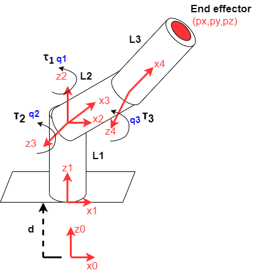
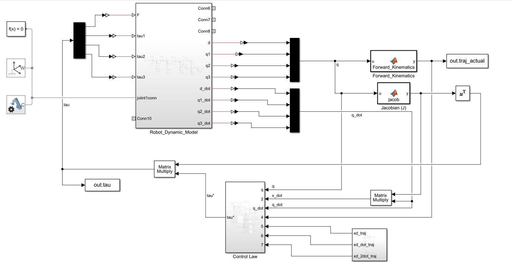
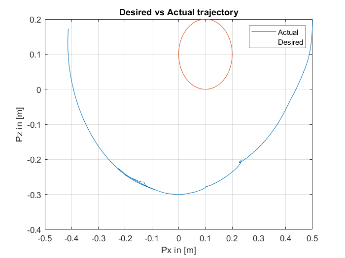
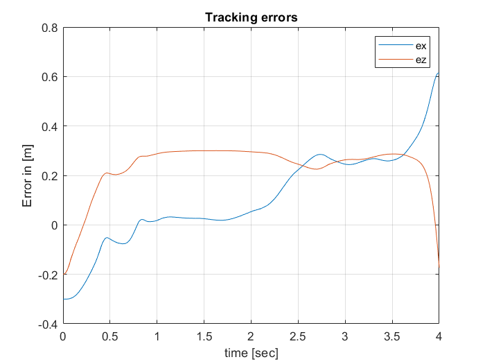

# Neural network based adaptive controller for end-effector tracking of redundant manipulators

<p>This document explores the neural network based
adaptive controller for redundant manipulators developed in
[1], aiming to implement it for the trajectory tracking of an endeffector in the x, y z cartesian space. The control scheme is based on estimating the robot dynamic matrices with neural networks and changing the neural network parameters using adaptive
control theory. The robot model is a 4 degrees of freedom
redundant manipulator and it was implemented in MATLAB
Simulink. After implementing the robot model and starting to
implement the controller, a dimension mismatch presented a
significant obstacle in the implementation of the adaptation laws
for the neural network parameters. Due to this obstacle, the
adaptation laws were not fully implemented. The results
obtained show the end-effector following a trajectory similar in
shape to the desired trajectory, but without tracking it. It is
concluded that further analysis needs to be performed with the
stability analysis that the authors did in order to resolve the
mismatch in the dimensions</p>

## Robot Model
</img>

## Simulink Model
</img>


## How to run the Simulink Model?

Open MATLAB and run the following command:

```
run dynamic_model_code.m
```
The MATLAB code runs everything, however the model can be found in the following simulink file:

```
dynamic_model_v4.slx
```

## Trajectory Tracking Graph
</img>

## Tracking Errors Graph
</img>


### References
```
[1]  B.  Daachi  and  A.  Benallegue,  "A  Neural  Network 
Adaptive Controller for End-effector Tracking of Redundant 
Robot  Manipulators,"  Journal  of  Intelligent  and  Robotic 
Systems, vol. 46, pp. 245-262, 2006. DOI: 10.1007/s10846-
006-9060-6.
```

